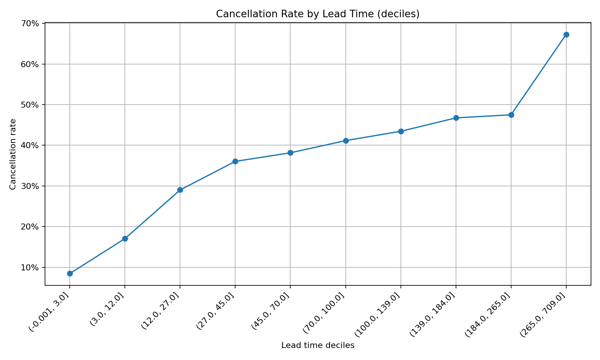

# Hotel Booking Data Analysis - For Learning

This project explores the **Hotel Booking dataset**, a rich real-world dataset containing hotel reservation details, cancellations, customer behavior, and pricing(Antonio, Almeida & Nunes, 2019, Kaggle/UCI).  
The aim is to perform **end-to-end analysis** using Excel, Python, and Tableau — showcasing how different tools can complement one another for data cleaning, exploration, visualization, and insights.

---

## 📂 Project Structure

```
.
├── data/
│   ├── raw/                  # Original dataset (hotel_bookings.csv)
│   ├── processed/            # Processed datasets exported for BI tools
├── notebooks/
│   ├── hotel_analysis.ipynb  # Python data cleaning, exploration, and visuals + ML
├── reports/
│   ├── figs/                 # Plots and charts generated in Python
├── README.md                 # Project documentation
```

---

## 🔹 Excel Analysis

Excel was used for **pivot-table style exploration** of the dataset:

1. **Booking Volume by Hotel Type & Year**  
   - Clustered column chart comparing Resort vs City hotel demand.  
   -  

2. **Cancellations by Market Segment**  
   - Pivot table showing which customer segments cancel most frequently.  
   -   

3. **ADR (Average Daily Rate) Trends by Month**  
   - Line chart of average pricing patterns across hotels.  
   - 

4. **Average Stay Duration by Customer Type**  
   - Bar chart of stay behavior across different customer types.  
   -   

---

## 🔹 Python Analysis

Python provided deeper data cleaning, preparation, more visualizations, and Machine Learning Model for cancellation prediction.

### Data Preparation
- Cleaned inconsistent column names and data types.  
- Converted date fields into datetime format.  
- Handled missing values in `children`, `agent`, and `company`.  
- Created processed tables for BI tools.

### Key Visualizations
1. **Bookings by Hotel Type & Year**  
   - Clustered column plot plot.  
   - 

2. **Cancellations by Market Segment**  
   - Cacellation frequency by customer type.  
   - 

3. **ADR by Month & Hotel**  
   - Seasonal pricing trends.  
   -   

4. **Stay Duration by Customer Type**  
   - Boxplot distribution to identify outliers.  
   - 

5. **Cancellation Rate by Lead Time (deciles)**
   - cancellation probability vs lead-time bins (deciles = splitting the dataset into 10 equal-sized groups).
   - Insight: Bookings made far in advance tend to have higher cancellation rates.
   - 

6. **Numeric Feature Correlations**
   - Heatmap showing correlation between numeric variables (lead time, total stay, ADR, etc.) and cancellation outcome.
   - Helps identify strong relationships before modeling (e.g., lead time and cancellation are positively correlated).
   - 

### Machine Learning (Bonus)
- Built a **logistic regression model** to predict cancellation likelihood.  

1. **Top Drivers of Cancellation (Logistic Regression)**
   - Bar plot of the most influential features from the logistic regression model.
   - Shows which variables (e.g., lead time, ADR, special requests) are most predictive of cancellations.
   - 

2. **ROC Curve — Cancellation Model (LogReg)**
   - Receiver Operating Characteristic curve for the logistic regression cancellation model.
   - Demonstrates the model’s ability to distinguish between cancelled vs non-cancelled bookings.
   - 

---

## 🔹 Tableau Dashboards

Data was connected to Tableau Public for interactive dashboards.

### Sheets
- **Booking Volume by Hotel Type & Year**
   -   
- **Cancellation Rate by Market Segment**
   -    
- **ADR Trends by Month & Hotel**
   - 
- **Average Stay Duration by Customer Type**
   - 
- **Monthly KPIs (Bookings vs Cancels, ADR, Cancellation Rate)**
   - 

---

## 🔹 Insights & Recommendations

### Key Insights
- **City Hotels** receive more bookings overall, but also higher cancellation rates.  
- **Resort Hotels** show strong seasonality in ADR (higher prices in summer).  
- **Corporate & Offline Travel Agents** segments are more stable (fewer cancellations).  
- **Transient customers** cancel the most frequently.  
- Average stay duration is longer for **Resort Hotels** and **Group bookings**.

### Recommendations
- Adjust **pricing strategy** for resorts during off-peak months to smooth demand.  
- Implement **stricter cancellation policies** for high-cancel segments (e.g., transient).  
- Incentivize **longer stays** (e.g., discounts for 4+ nights).  
- Monitor ADR trends for revenue management optimization.

---

## 📊 Tools Used

- **Excel** → Pivot tables and quick exploration.  
- **Python (Pandas, Matplotlib, Seaborn, Plotly)** → Cleaning, advanced visualizations, ML.  
- **Tableau Public** → Dashboards & interactive storytelling.  

---

## 🚀 Next Steps

- Expand the machine learning model with Random Forest / XGBoost.  
- Add more BI dashboards combining customer and cancellation insights.  
- Automate monthly KPI reporting pipeline.

---

## 📌 Summary

This project demonstrates how to take a raw hotel booking dataset and transform it into **business insights** through a combination of:  
- Spreadsheet analysis (Excel)  
- Data science workflow (Python)  
- BI dashboards (Tableau)  

It provides a **full analytics workflow** from raw data to actionable recommendations.
